# Encoding System Dependency Graph

## Visual Dependency Map

```mermaid
graph TB
    %% Core Layer
    subgraph "Core Interfaces"
        I[interface.go]
        I --> IE[Encoder]
        I --> ID[Decoder]
        I --> ISE[StreamEncoder]
        I --> ISD[StreamDecoder]
        I --> IC[Codec]
        I --> ISC[StreamCodec]
        I --> ICN[ContentNegotiator]
        I --> IEF[EncoderFactory]
        I --> IDF[DecoderFactory]
        I --> ICF[CodecFactory]
    end

    %% Factory Layer
    subgraph "Factory Implementations"
        F[factories.go]
        F --> DEF[DefaultEncoderFactory]
        F --> DDF[DefaultDecoderFactory]
        F --> DCF[DefaultCodecFactory]
        F --> PEF[PluginEncoderFactory]
        F --> PDF[PluginDecoderFactory]
        F --> CEF[CachingEncoderFactory]
    end

    %% Registry Layer
    subgraph "Registry System"
        R[registry.go]
        R --> FR[FormatRegistry]
        R --> FI[format_info.go]
        FI --> FIC[FormatInfo]
        FI --> FC[FormatCapabilities]
    end

    %% Format Implementations
    subgraph "JSON Implementation"
        J[json/json.go]
        JE[json/json_encoder.go]
        JD[json/json_decoder.go]
        JC[json/json_codec.go]
        JS[json/json_streaming.go]
        JI[json/init.go]
        
        J --> JE
        J --> JD
        JE --> JC
        JD --> JC
        JC --> JS
        JI --> R
    end

    subgraph "Protobuf Implementation"
        P[protobuf/protobuf_codec.go]
        PE[protobuf/protobuf_encoder.go]
        PD[protobuf/protobuf_decoder.go]
        PS[protobuf/protobuf_streaming.go]
        PI[protobuf/init.go]
        
        PE --> P
        PD --> P
        P --> PS
        PI --> R
    end

    %% Negotiation System
    subgraph "Content Negotiation"
        N[negotiation/negotiator.go]
        NP[negotiation/parser.go]
        NS[negotiation/selector.go]
        NPF[negotiation/performance.go]
        
        N --> NP
        N --> NS
        N --> NPF
    end

    %% Streaming System
    subgraph "Streaming Components"
        US[streaming/unified_streaming.go]
        SM[streaming/stream_manager.go]
        CE[streaming/chunked_encoder.go]
        SFC[streaming/flow_control.go]
        SMT[streaming/metrics.go]
        
        US --> SM
        US --> CE
        SM --> SFC
        US --> SMT
        CE --> SMT
    end

    %% Validation System
    subgraph "Validation Framework"
        V[validation/validator.go]
        VS[validation/security.go]
        VC[validation/compatibility.go]
        VT[validation/test_vectors.go]
        VB[validation/benchmark.go]
        
        V --> VS
        V --> VC
        VT --> V
        VB --> V
    end

    %% Dependencies between layers
    I --> F
    I --> R
    F --> JE
    F --> JD
    F --> PE
    F --> PD
    R --> N
    JE --> I
    JD --> I
    PE --> I
    PD --> I
    US --> I
    US --> JC
    US --> P
    V --> I
    R --> V

    %% External Dependencies
    subgraph "External Dependencies"
        E[events.Event]
        IO[io.Reader/Writer]
        CTX[context.Context]
    end

    I --> E
    I --> IO
    I --> CTX
```

## Dependency Analysis

### Layer Structure

1. **Core Layer (interface.go)**
   - Defines all interfaces
   - No dependencies on implementations
   - Depends only on events package and standard library

2. **Factory Layer (factories.go)**
   - Implements factory patterns
   - Depends on core interfaces
   - No direct format dependencies

3. **Registry Layer**
   - Central registration point
   - Manages format metadata
   - Coordinates between formats

4. **Implementation Layer**
   - JSON and Protobuf implementations
   - Implement core interfaces
   - Register with registry via init()

5. **Enhancement Layers**
   - Negotiation: Content type selection
   - Streaming: Advanced streaming features
   - Validation: Cross-cutting validation

### Critical Dependencies

1. **events.Event** - All encoding/decoding operates on events
2. **io.Reader/Writer** - Streaming interfaces
3. **context.Context** - Cancellation and timeouts

### Circular Dependencies
- None detected in current structure

### Tight Coupling Areas
1. Registry ↔ Format implementations (via init())
2. Streaming components ↔ Base codecs
3. Validation ↔ All encoding operations

## Improvement Opportunities

1. **Interface Segregation**
   - Consider splitting large interfaces
   - Separate concerns more clearly

2. **Dependency Injection**
   - Reduce init() magic
   - Make dependencies explicit

3. **Layering Enforcement**
   - Ensure no upward dependencies
   - Clear separation of concerns

4. **Testing Seams**
   - Interfaces allow mocking
   - Consider test-specific factories