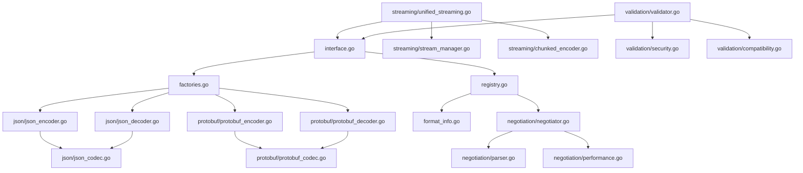

# Encoding System Analysis for Phase 2 Improvements

## 1. Interface Hierarchy and Relationships

### Core Interfaces (interface.go)
```
├── Encoder (basic encoding)
│   ├── Encode(event) → []byte
│   ├── EncodeMultiple(events) → []byte
│   ├── ContentType() → string
│   └── CanStream() → bool
│
├── Decoder (basic decoding)
│   ├── Decode(data) → Event
│   ├── DecodeMultiple(data) → []Event
│   ├── ContentType() → string
│   └── CanStream() → bool
│
├── StreamEncoder (extends Encoder)
│   ├── EncodeStream(ctx, <-chan Event, Writer)
│   ├── StartStream(Writer)
│   ├── WriteEvent(Event)
│   └── EndStream()
│
├── StreamDecoder (extends Decoder)
│   ├── DecodeStream(ctx, Reader, chan<- Event)
│   ├── StartStream(Reader)
│   ├── ReadEvent() → Event
│   └── EndStream()
│
├── Codec (combines Encoder + Decoder)
│
├── StreamCodec (combines Codec + streaming)
│   ├── GetStreamEncoder() → StreamEncoder
│   └── GetStreamDecoder() → StreamDecoder
│
├── ContentNegotiator
│   ├── Negotiate(acceptHeader) → string
│   ├── SupportedTypes() → []string
│   ├── PreferredType() → string
│   └── CanHandle(contentType) → bool
│
└── Factory Interfaces
    ├── EncoderFactory
    ├── DecoderFactory
    └── CodecFactory
```

### Error Types
- `EncodingError` - wraps encoding failures with context
- `DecodingError` - wraps decoding failures with context  
- `ValidationError` - field-level validation errors

## 2. Factory Implementations and Return Types

### factories.go
1. **DefaultEncoderFactory**
   - Returns: `Encoder` or `StreamEncoder`
   - Uses constructor functions stored in maps
   - Thread-safe with RWMutex

2. **DefaultDecoderFactory**
   - Returns: `Decoder` or `StreamDecoder`
   - Similar pattern to encoder factory

3. **DefaultCodecFactory**
   - Wraps both encoder and decoder factories
   - Returns composite codecs

4. **PluginEncoderFactory/PluginDecoderFactory**
   - Extends default factories with plugin support
   - Allows dynamic registration

5. **CachingEncoderFactory**
   - Wraps another factory with caching
   - Uses sync.Map for thread-safe caching
   - Creates cache keys from content type + options

### Concrete Implementations
- **JSON**: `JSONEncoder`, `JSONDecoder`, `JSONCodec`, `StreamingJSONEncoder/Decoder`
- **Protobuf**: `ProtobufEncoder`, `ProtobufDecoder`, `ProtobufCodec`, `StreamingProtobufEncoder/Decoder`

## 3. Error Handling Patterns

### Current Patterns
1. **Custom Error Types**
   - Structured errors with context (EncodingError, DecodingError)
   - Implement error unwrapping

2. **Error Creation**
   - Heavy use of `fmt.Errorf` with %w for wrapping
   - Some use of `errors.New` for simple errors
   - Inconsistent error message formatting

3. **Error Context**
   - Some errors include format, event, and cause
   - Not all errors provide sufficient context

### Inconsistencies Found
- Mix of error creation styles
- Inconsistent capitalization in error messages
- Some errors lack proper context wrapping
- No centralized error constants

## 4. Object Creation Points (for Pooling)

### High-Frequency Allocations
1. **Encoder/Decoder Creation**
   - `NewJSONEncoder()` - creates new encoder each time
   - `NewProtobufEncoder()` - similar pattern
   - Good candidates for pooling

2. **Buffer Allocations**
   - `bytes.Buffer` in JSON encoding
   - Byte slices for encoding output
   - Protocol buffer messages

3. **Event Processing**
   - Temporary structs for marshaling
   - Slice allocations in `EncodeMultiple`
   - Channel creation in streaming

4. **Validation Objects**
   - Validator instances
   - Temporary data structures for validation

### Current Object Creation
```go
// Examples of object creation that could benefit from pooling:
- JSONEncoder: Created per encode operation
- bytes.Buffer: Multiple allocations in encoding paths
- []byte slices: Return values from encode operations
- Validator instances: Created frequently
- Error objects: Could use error pooling
```

## 5. Common Code Patterns

### Patterns to Extract
1. **Mutex Locking Pattern**
   ```go
   mu.Lock()
   defer mu.Unlock()
   // or RLock/RUnlock for reads
   ```

2. **Nil Checking Pattern**
   ```go
   if x == nil {
       return nil, fmt.Errorf("x cannot be nil")
   }
   ```

3. **Options Defaulting**
   ```go
   if options == nil {
       options = &DefaultOptions{}
   }
   ```

4. **Content Type Resolution**
   - Alias resolution
   - Parameter stripping
   - Case normalization

5. **Error Wrapping**
   - Consistent error context addition
   - Format-specific error creation

## 6. Dependency Graph



### Key Dependencies
1. **Core Interfaces** → Everything depends on interface.go
2. **Factories** → Central to object creation
3. **Registry** → Manages format registration and lookup
4. **Format Implementations** → Depend on interfaces and base types
5. **Streaming** → Builds on top of basic encoding/decoding
6. **Validation** → Cross-cuts all encoding operations

## Phase 2 Improvement Opportunities

### 1. Object Pooling Implementation
- Create pools for frequently allocated objects
- Implement Reset() methods for pooled objects
- Add pool statistics and monitoring

### 2. Error Handling Standardization
- Define error constants
- Create error factory functions
- Implement consistent error context

### 3. Common Pattern Extraction
- Create utility functions for common patterns
- Implement helper types for repeated logic
- Add code generation for boilerplate

### 4. Performance Optimizations
- Reduce allocations through pooling
- Optimize buffer usage
- Implement zero-copy where possible

### 5. Interface Simplification
- Consider reducing interface complexity
- Evaluate StreamCodec method conflict resolution
- Improve factory interface consistency

### 6. Dependency Reduction
- Identify circular dependencies
- Reduce coupling between packages
- Consider interface segregation

This analysis provides the foundation for Phase 2 improvements while ensuring backward compatibility and maintaining the current functionality.