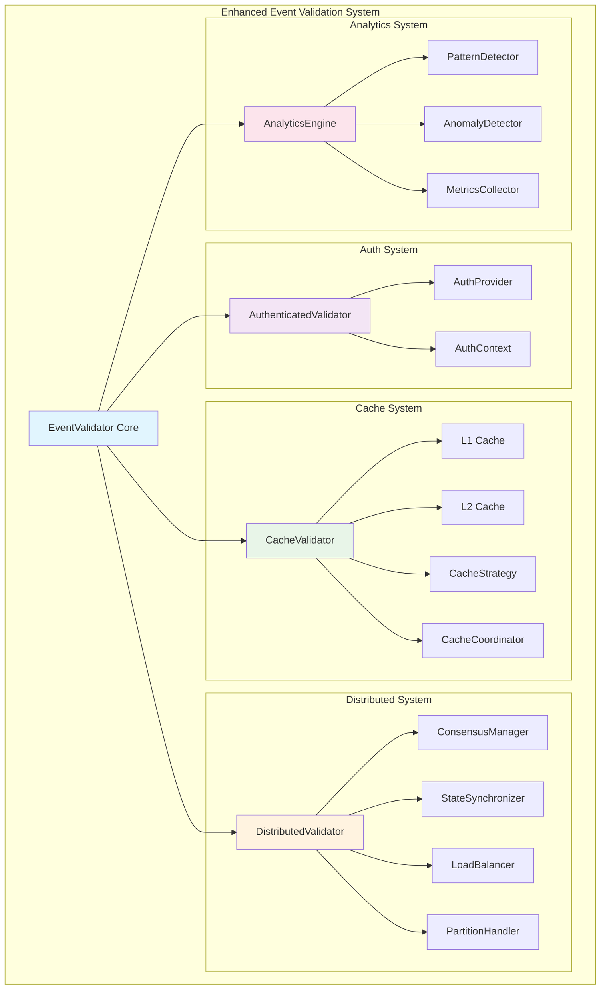
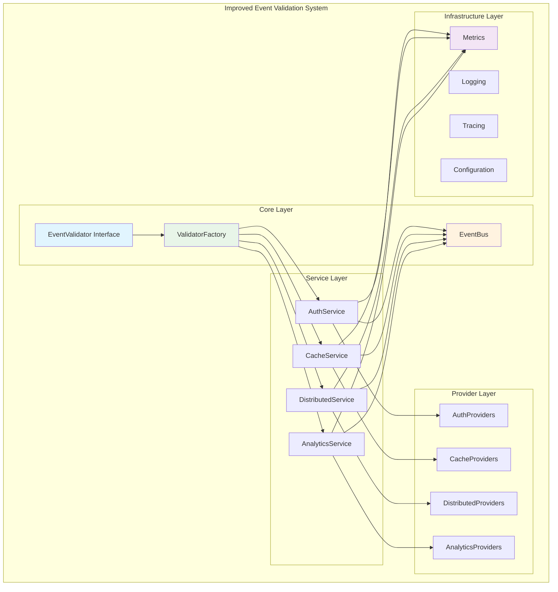

# Architecture and Design Review: Enhanced Event Validation PR

## Executive Summary

This comprehensive review analyzes the architectural changes introduced in the enhanced-event-validation PR, which adds four major systems to the AG-UI Go SDK: authentication (auth), caching (cache), distributed validation (distributed), and analytics. While these additions provide significant capabilities, there are several architectural concerns regarding modularity, coupling, and design consistency that should be addressed.

## Overall Assessment

**Rating: B+ (Good with Areas for Improvement)**

### Strengths
- **Comprehensive Feature Set**: Covers authentication, caching, distributed systems, and analytics
- **Interface-Based Design**: Proper use of Go interfaces for extensibility
- **Documentation Quality**: Excellent README files with clear examples
- **Thread Safety**: Proper concurrent programming patterns
- **Testing Coverage**: Comprehensive test suites for each module

### Areas for Improvement
- **High Coupling**: Deep interdependencies between new modules
- **Architecture Consistency**: Mixed patterns across different packages
- **Interface Complexity**: Some interfaces are overly broad
- **Configuration Management**: Inconsistent configuration patterns

## 1. Overall System Architecture Alignment

### Current Architecture Flow
```
┌─────────────────────────────────────────────────────────────────┐
│                    EventValidator (Core)                       │
├─────────────────────────────────────────────────────────────────┤
│  ┌─────────────┐  ┌─────────────┐  ┌─────────────┐  ┌─────────┐ │
│  │ Auth System │  │ Cache Layer │  │ Analytics   │  │ Distrib │ │
│  │             │  │             │  │ Engine      │  │ Validat │ │
│  └─────────────┘  └─────────────┘  └─────────────┘  └─────────┘ │
└─────────────────────────────────────────────────────────────────┘
                           │
                           ▼
┌─────────────────────────────────────────────────────────────────┐
│                    External Systems                            │
│  ┌─────────────┐  ┌─────────────┐  ┌─────────────┐            │
│  │ Transport   │  │ Tools       │  │ State       │            │
│  │ Layer       │  │ System      │  │ Management  │            │
│  └─────────────┘  └─────────────┘  └─────────────┘            │
└─────────────────────────────────────────────────────────────────┘
```

### Architectural Alignment Analysis

#### ✅ Strengths
1. **Layered Architecture**: New systems properly layer on top of existing validation core
2. **Existing Interface Compliance**: New validators implement the same interfaces as existing ones
3. **Incremental Enhancement**: Adds capabilities without breaking existing functionality
4. **Plugin Architecture**: Auth and cache systems support pluggable providers

#### ⚠️ Concerns
1. **Architecture Inconsistency**: Different modules use varying architectural patterns
2. **Cross-Module Dependencies**: Some unnecessary coupling between auth, cache, and distributed systems
3. **Configuration Fragmentation**: Each module has its own configuration pattern

## 2. Separation of Concerns Analysis

### Auth Package (`pkg/core/events/auth/`)

#### ✅ Well-Separated Concerns
- **Authentication vs Authorization**: Clear separation between credential validation and permission checking
- **Provider Abstraction**: Clean interface for different auth backends
- **Credential Types**: Separate handling for basic, token, and API key credentials

#### ⚠️ Areas for Improvement
```go
// Current: Tight coupling in authenticated_validator.go
type AuthenticatedValidator struct {
    validator *events.Validator
    provider  AuthProvider
    config    *AuthConfig
    hooks     []Hook // Mixed concerns: business logic + infrastructure
    metrics   *AuthMetrics // Should be separated
}

// Recommendation: Separate metrics collection
type AuthenticatedValidator struct {
    validator       *events.Validator
    provider        AuthProvider
    config          *AuthConfig
    hookManager     *HookManager
    metricsCollector MetricsCollector // Interface for better separation
}
```

### Cache Package (`pkg/core/events/cache/`)

#### ✅ Strong Architecture
- **Multi-Level Separation**: Clear L1/L2 cache distinction
- **Strategy Pattern**: Pluggable cache strategies
- **Coordinator Separation**: Distributed coordination is isolated

#### ⚠️ Coupling Issues
```go
// Current: CacheValidator tightly couples validation and caching
type CacheValidator struct {
    l1Cache     *lru.Cache[string, *ValidationCacheEntry]
    l2Cache     DistributedCache
    validator   *events.Validator  // Tight coupling
    coordinator *CacheCoordinator  // Should be optional
}

// Recommendation: Use composition and interfaces
type CacheValidator struct {
    cacheManager  CacheManager      // Encapsulates L1/L2 logic
    validator     EventValidator    // Interface, not concrete type
    coordinator   Coordinator       // Optional interface
}
```

### Distributed Package (`pkg/core/events/distributed/`)

#### ✅ Good Component Separation
- **Consensus Management**: Isolated consensus algorithms
- **Load Balancing**: Separate load balancer component
- **State Synchronization**: Independent state sync module

#### ⚠️ Complex Interdependencies
```go
// Current: DistributedValidator manages too many concerns
type DistributedValidator struct {
    consensus        *ConsensusManager
    stateSync        *StateSynchronizer
    partitionHandler *PartitionHandler
    loadBalancer     *LoadBalancer
    // All components are tightly coupled
}
```

### Analytics Package (`pkg/core/events/analytics/`)

#### ✅ Clean Separation
- **Pattern Detection**: Isolated pattern recognition logic
- **Anomaly Detection**: Separate anomaly detection algorithms
- **Metrics Collection**: Independent metrics system

## 3. Design Patterns Usage and Appropriateness

### Patterns Used

#### ✅ Well-Implemented Patterns

1. **Strategy Pattern** (Cache Strategies)
```go
type CacheStrategy interface {
    ShouldCache(event Event) bool
    GetTTL(event Event) time.Duration
    OnHit(key string)
    OnMiss(key string)
}
// Multiple implementations: TTLStrategy, LFUStrategy, CompositeStrategy
```

2. **Provider Pattern** (Auth Providers)
```go
type AuthProvider interface {
    Authenticate(ctx context.Context, credentials Credentials) (*AuthContext, error)
    Authorize(ctx context.Context, authCtx *AuthContext, resource, action string) error
}
```

3. **Observer Pattern** (Auth Hooks)
```go
type PreValidationHook func(ctx context.Context, event Event, authCtx *AuthContext) error
type PostValidationHook func(ctx context.Context, event Event, authCtx *AuthContext, result *ValidationResult) error
```

#### ⚠️ Pattern Issues

1. **God Object Anti-Pattern**
```go
// DistributedValidator tries to do too much
type DistributedValidator struct {
    // Validation, consensus, load balancing, state sync, metrics...
    // Should be decomposed using Facade pattern
}
```

2. **Configuration Object Explosion**
```go
// Too many configuration structs with overlapping concerns
type CacheValidatorConfig struct { /* 15+ fields */ }
type DistributedValidatorConfig struct { /* 10+ fields */ }
type AuthConfig struct { /* 8+ fields */ }
```

### Recommended Pattern Improvements

#### 1. Builder Pattern for Complex Configurations
```go
type ValidatorBuilder struct {
    auth        AuthConfig
    cache       CacheConfig
    distributed DistributedConfig
    analytics   AnalyticsConfig
}

func (b *ValidatorBuilder) WithAuth(provider AuthProvider) *ValidatorBuilder
func (b *ValidatorBuilder) WithCache(strategy CacheStrategy) *ValidatorBuilder
func (b *ValidatorBuilder) Build() (*EnhancedValidator, error)
```

#### 2. Facade Pattern for DistributedValidator
```go
type DistributedValidator struct {
    validator     EventValidator
    nodeManager   NodeManager
    consensus     ConsensusManager
    loadBalancer  LoadBalancer
}
```

## 4. Module Coupling and Cohesion Analysis

### Coupling Analysis

#### ⚠️ High Coupling Issues

1. **Cache → Auth Dependency**
```go
// In cache/cache_validator.go
type ValidationCacheKey struct {
    ValidatorID string // Should not know about auth system
}
```

2. **Distributed → All Systems**
```go
// DistributedValidator imports and uses all other packages
import (
    "github.com/ag-ui/go-sdk/pkg/core/events/auth"
    "github.com/ag-ui/go-sdk/pkg/core/events/cache"
    "github.com/ag-ui/go-sdk/pkg/core/events/analytics"
)
```

### Cohesion Analysis

#### ✅ High Cohesion Examples

1. **Auth Package**: All components relate to authentication/authorization
2. **Analytics Package**: Focused on event analysis and metrics
3. **Cache Package**: Cohesive around caching concerns

#### ⚠️ Low Cohesion Issues

1. **Mixed Infrastructure and Business Logic**
```go
// In auth/authenticated_validator.go
type AuthenticatedValidator struct {
    // Business logic
    validator *events.Validator
    // Infrastructure
    metrics   *AuthMetrics
    // Configuration
    config    *AuthConfig
}
```

### Recommended Coupling Improvements

#### 1. Dependency Injection
```go
type ValidatorFactory interface {
    CreateValidator(config ValidatorConfig) (EventValidator, error)
}

type EnhancedValidatorFactory struct {
    authFactory       AuthFactory
    cacheFactory      CacheFactory
    distributedFactory DistributedFactory
}
```

#### 2. Event-Driven Architecture
```go
type EventBus interface {
    Subscribe(eventType string, handler EventHandler)
    Publish(event Event)
}

// Instead of direct coupling, use events for communication
```

## 5. Interface Design and Abstraction Levels

### Interface Quality Assessment

#### ✅ Well-Designed Interfaces

1. **AuthProvider Interface** - Focused and cohesive
```go
type AuthProvider interface {
    Authenticate(ctx context.Context, credentials Credentials) (*AuthContext, error)
    Authorize(ctx context.Context, authCtx *AuthContext, resource, action string) error
    Refresh(ctx context.Context, authCtx *AuthContext) (*AuthContext, error)
    Revoke(ctx context.Context, authCtx *AuthContext) error
    ValidateContext(ctx context.Context, authCtx *AuthContext) error
    GetProviderType() string
}
```

2. **CacheStrategy Interface** - Single responsibility
```go
type CacheStrategy interface {
    ShouldCache(event Event) bool
    GetTTL(event Event) time.Duration
    OnHit(key string)
    OnMiss(key string)
}
```

#### ⚠️ Interface Issues

1. **Overly Broad Interfaces**
```go
// DistributedCache interface tries to do too much
type DistributedCache interface {
    Get(ctx context.Context, key string) ([]byte, error)
    Set(ctx context.Context, key string, value []byte, ttl time.Duration) error
    Delete(ctx context.Context, key string) error
    Exists(ctx context.Context, key string) (bool, error)
    TTL(ctx context.Context, key string) (time.Duration, error)
    Scan(ctx context.Context, pattern string) ([]string, error) // Should be separate interface
}
```

2. **Missing Abstraction Levels**
```go
// Missing intermediate abstractions
// Should have: BasicCache, AdvancedCache, DistributedCache hierarchy
```

### Recommended Interface Improvements

#### 1. Interface Segregation
```go
type BasicCache interface {
    Get(ctx context.Context, key string) ([]byte, error)
    Set(ctx context.Context, key string, value []byte, ttl time.Duration) error
    Delete(ctx context.Context, key string) error
}

type CacheIntrospection interface {
    Exists(ctx context.Context, key string) (bool, error)
    TTL(ctx context.Context, key string) (time.Duration, error)
}

type CacheDiscovery interface {
    Scan(ctx context.Context, pattern string) ([]string, error)
}

type DistributedCache interface {
    BasicCache
    CacheIntrospection
    CacheDiscovery
}
```

#### 2. Abstraction Hierarchy
```go
type Validator interface {
    ValidateEvent(ctx context.Context, event Event) (*ValidationResult, error)
}

type EnhancedValidator interface {
    Validator
    GetMetrics() Metrics
    GetHealth() HealthStatus
}

type DistributedValidator interface {
    EnhancedValidator
    GetClusterStatus() ClusterStatus
    RegisterNode(node NodeInfo) error
}
```

## 6. Backward Compatibility Assessment

### Compatibility Analysis

#### ✅ Excellent Backward Compatibility

1. **Interface Compliance**: All new validators implement existing EventValidator interface
2. **Drop-in Replacement**: New validators can replace existing ones without code changes
3. **Configuration Isolation**: New configuration doesn't affect existing code

#### Example Compatibility
```go
// Before
validator := events.NewValidator(config)
err := validator.ValidateEvent(ctx, event)

// After - works without changes
cacheValidator, _ := cache.NewCacheValidator(cacheConfig)
err := cacheValidator.ValidateEvent(ctx, event)

authValidator := auth.NewAuthenticatedValidator(authConfig, provider, hooks)
err := authValidator.ValidateEvent(ctx, event)
```

#### ⚠️ Potential Compatibility Issues

1. **Configuration Bloat**
```go
// Configuration objects are growing complex
// May impact future compatibility
type CacheValidatorConfig struct {
    // 15+ configuration fields
    // Adding more fields may break existing configurations
}
```

2. **Performance Impact**
```go
// New features add overhead
// May affect existing performance-sensitive code
```

### Compatibility Recommendations

1. **Versioned Configurations**
```go
type ValidatorConfigV1 struct { /* existing */ }
type ValidatorConfigV2 struct { /* enhanced */ }

type ConfigMigrator interface {
    MigrateV1ToV2(v1 ValidatorConfigV1) ValidatorConfigV2
}
```

2. **Feature Flags**
```go
type FeatureFlags struct {
    EnableAuth        bool
    EnableCache       bool
    EnableDistributed bool
    EnableAnalytics   bool
}
```

## 7. Architectural Diagrams

### Current System Architecture



### Recommended Architecture



## 8. Design Flaws and Issues

### Critical Issues

#### 1. **Circular Dependencies Risk**
```go
// auth package imports events
// cache package imports events and potentially auth
// distributed package imports events, auth, cache
// Risk of circular dependencies
```

#### 2. **Configuration Management Chaos**
```go
// Multiple configuration patterns
type AuthConfig struct { /* pattern 1 */ }
type CacheValidatorConfig struct { /* pattern 2 */ }
type DistributedValidatorConfig struct { /* pattern 3 */ }
// Should use consistent configuration pattern
```

#### 3. **Resource Management Issues**
```go
// Multiple systems managing their own resources
// No central resource management
// Risk of resource leaks and conflicts
```

### Moderate Issues

#### 1. **Error Handling Inconsistency**
```go
// Different error types across packages
// No unified error handling strategy
```

#### 2. **Metrics Fragmentation**
```go
// Each package has its own metrics
// No unified metrics collection
```

#### 3. **Testing Complexity**
```go
// Testing one component requires mocking multiple systems
// High test setup complexity
```

## 9. Recommendations and Improvements

### Immediate Fixes (High Priority)

#### 1. **Unified Configuration System**
```go
type ValidatorConfig struct {
    Auth        *AuthConfig
    Cache       *CacheConfig
    Distributed *DistributedConfig
    Analytics   *AnalyticsConfig
}

type ValidatorBuilder struct {
    config ValidatorConfig
}

func NewValidatorBuilder() *ValidatorBuilder
func (b *ValidatorBuilder) WithAuth(config AuthConfig) *ValidatorBuilder
func (b *ValidatorBuilder) Build() (EventValidator, error)
```

#### 2. **Interface Segregation**
```go
// Split large interfaces into focused ones
type EventValidator interface {
    ValidateEvent(ctx context.Context, event Event) (*ValidationResult, error)
}

type MetricsProvider interface {
    GetMetrics() Metrics
}

type HealthProvider interface {
    GetHealth() HealthStatus
}

type EnhancedValidator interface {
    EventValidator
    MetricsProvider
    HealthProvider
}
```

#### 3. **Dependency Injection Container**
```go
type Container interface {
    Register(name string, factory Factory)
    Resolve(name string) (interface{}, error)
}

type ValidatorContainer struct {
    container Container
}
```

### Medium-Term Improvements

#### 1. **Event-Driven Architecture**
```go
type Event interface {
    Type() string
    Timestamp() time.Time
    Data() map[string]interface{}
}

type EventBus interface {
    Subscribe(eventType string, handler EventHandler)
    Publish(event Event)
    Unsubscribe(eventType string, handler EventHandler)
}
```

#### 2. **Plugin System**
```go
type Plugin interface {
    Name() string
    Version() string
    Initialize(config map[string]interface{}) error
    Shutdown() error
}

type PluginManager interface {
    LoadPlugin(path string) (Plugin, error)
    UnloadPlugin(name string) error
    ListPlugins() []Plugin
}
```

#### 3. **Unified Resource Management**
```go
type ResourceManager interface {
    AllocateResource(resourceType string, config ResourceConfig) (Resource, error)
    ReleaseResource(resource Resource) error
    ListResources() []Resource
}
```

### Long-Term Architectural Improvements

#### 1. **Microservices Architecture**
```go
// Split into separate services that can be deployed independently
type AuthService interface { /* auth operations */ }
type CacheService interface { /* cache operations */ }
type ValidationService interface { /* validation operations */ }
```

#### 2. **API Gateway Pattern**
```go
type Gateway interface {
    Route(request Request) (Response, error)
    AddRoute(pattern string, handler Handler)
    AddMiddleware(middleware Middleware)
}
```

#### 3. **CQRS Pattern for Complex Operations**
```go
type Command interface {
    Execute(ctx context.Context) error
}

type Query interface {
    Execute(ctx context.Context) (interface{}, error)
}

type CommandBus interface {
    Handle(command Command) error
}

type QueryBus interface {
    Handle(query Query) (interface{}, error)
}
```

## 10. Performance and Scalability Considerations

### Performance Analysis

#### ✅ Performance Strengths
1. **Efficient Caching**: Multi-level caching with LRU and compression
2. **Concurrent Design**: Proper use of goroutines and channels
3. **Connection Pooling**: In distributed validator
4. **Circuit Breakers**: Prevent cascade failures

#### ⚠️ Performance Concerns
1. **Memory Usage**: Multiple caches and buffers may consume significant memory
2. **CPU Overhead**: Additional processing layers add CPU cost
3. **Network Chattiness**: Distributed consensus may generate significant network traffic

### Scalability Assessment

#### Horizontal Scaling
- **Distributed Validator**: Supports adding nodes dynamically
- **Cache Coordination**: Proper shard management
- **Load Balancing**: Multiple algorithms available

#### Vertical Scaling
- **Memory Scaling**: Configurable cache sizes
- **CPU Scaling**: Parallel validation support
- **I/O Scaling**: Async operations where appropriate

## 11. Security Considerations

### Security Strengths
1. **Authentication Framework**: Comprehensive auth system
2. **Authorization Model**: Resource-action permission model
3. **Secure Defaults**: Reasonable default configurations
4. **Input Validation**: Proper credential validation

### Security Concerns
1. **Password Hashing**: Uses SHA-256 instead of bcrypt/Argon2
2. **Token Management**: No built-in token rotation
3. **Audit Logging**: Limited audit trail capabilities
4. **Rate Limiting**: Basic implementation, could be more sophisticated

## Conclusion

The enhanced event validation PR introduces significant capabilities to the AG-UI Go SDK, with a generally solid architectural foundation. The main strengths lie in comprehensive feature coverage, proper interface design, and excellent documentation. However, the architecture would benefit from reduced coupling, more consistent design patterns, and better separation of concerns.

The recommended improvements focus on:
1. **Unified Configuration and Dependency Injection** for better modularity
2. **Interface Segregation** for cleaner abstractions
3. **Event-Driven Architecture** for loose coupling
4. **Resource Management** for better lifecycle control

With these improvements, the enhanced event validation system would provide a robust, scalable, and maintainable foundation for complex event processing scenarios while maintaining the simplicity needed for basic use cases.

### Final Recommendation

**Approve with requested changes** - The PR provides valuable functionality but should implement the high-priority recommendations before merge to ensure long-term maintainability and architectural consistency.